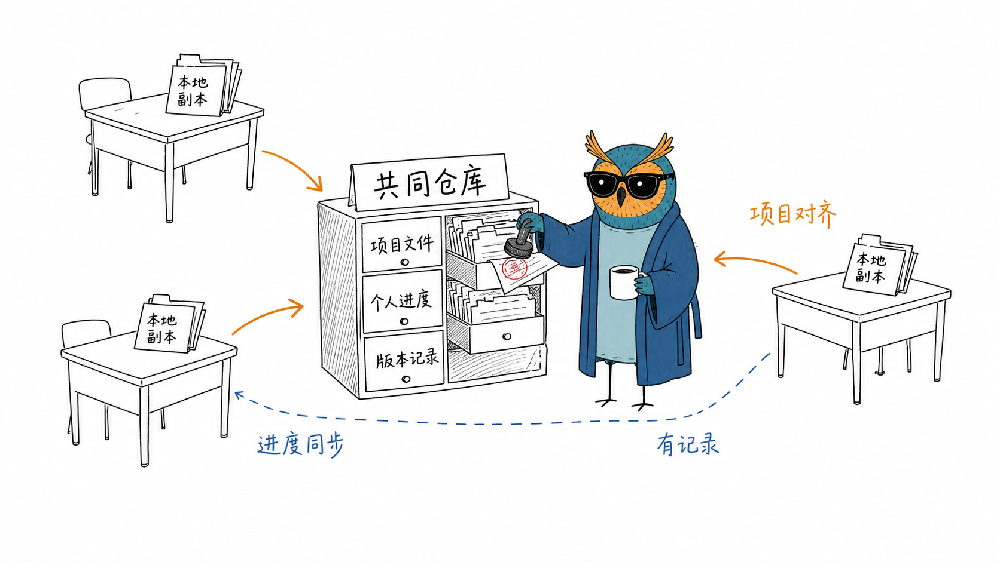
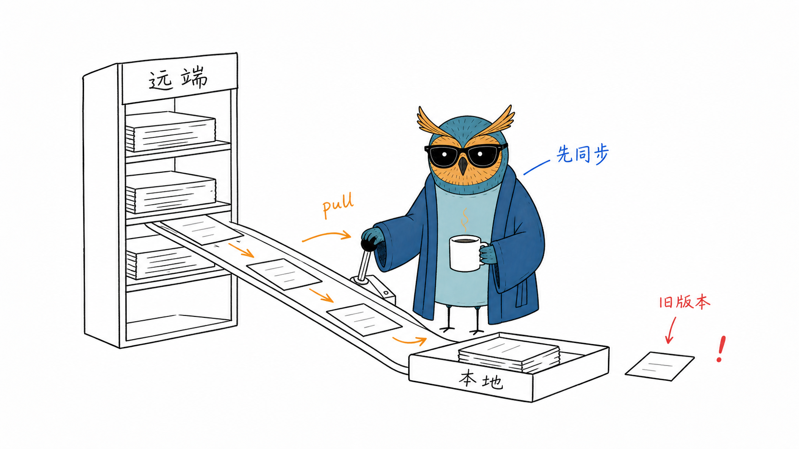
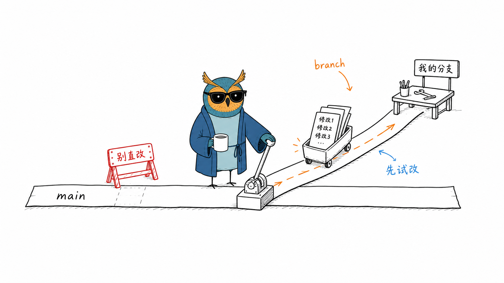
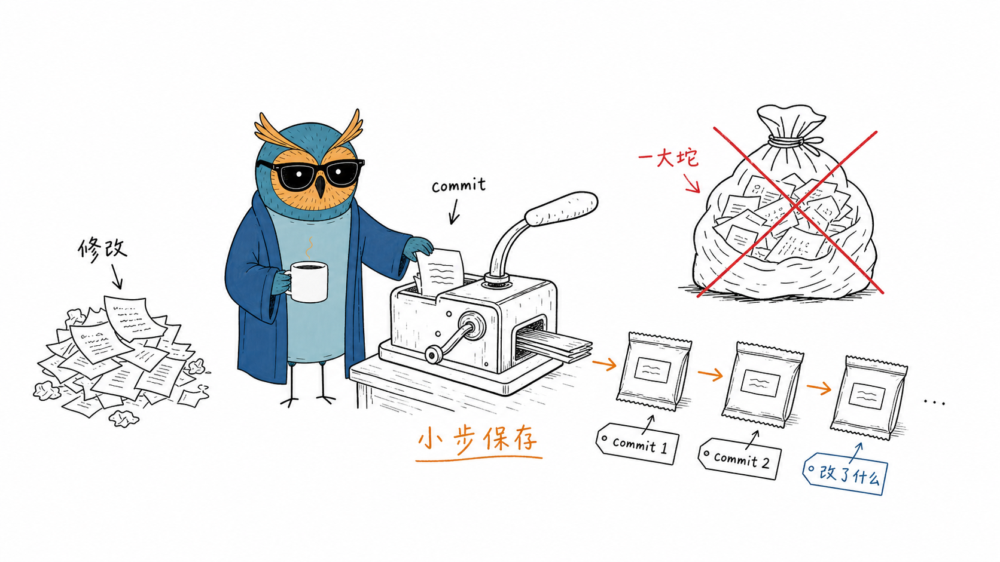
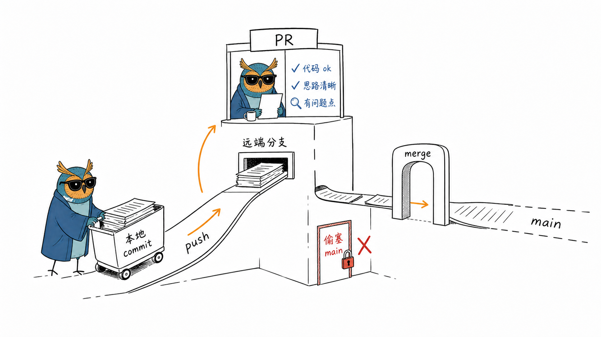
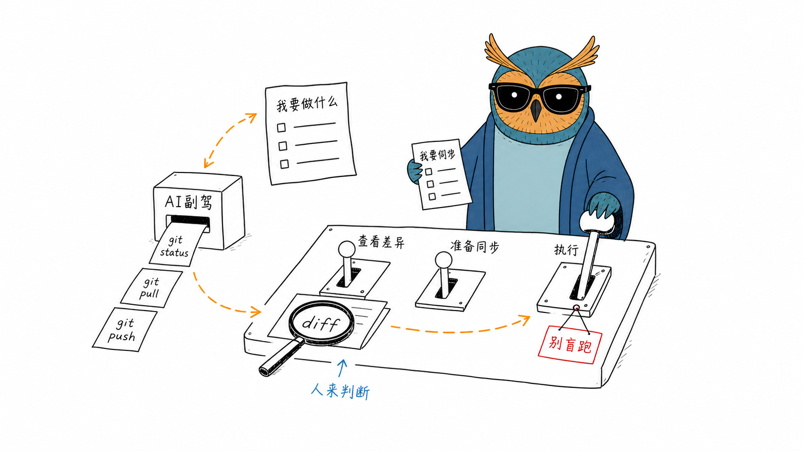

# NightSailing Illustrator

一个用于为**中文文章生成正文漫画配图**的技能（skill）。它把文章里的关键判断、流程、结构、状态或隐喻，变成一张清爽、怪诞、有创意、可读但不说明书的手绘解释图，固定主角是「夜航猫头鹰」。

> ⚠️ **仅推荐在 Codex 中使用。** 本技能依赖 **Codex 上 GPT 的生图能力**（内置 `image_gen`）来实际出图。在没有等效生图工具的环境（如仅有文本能力的助手）里，它只能产出配图策略 / shot list，无法生成图片。

---

## 这个技能能做什么

- **配图策略**：读完你的中文文章，给出一份 shot list —— 每张图放在哪段之后、主题、核心意思、结构类型、猫头鹰在图里做什么、建议的中文标注词。
- **单张生成**：用内置生图能力，逐张生成 16:9 横版手绘正文漫画，每张只讲一个核心结构。
- **风格约束**：纯白背景、黑色手绘线稿、少量红/橙/蓝中文手写批注、大量留白；拒绝 PPT、商业插画、幼稚可爱、复杂架构图。

### 视觉主角：夜航猫头鹰

蓝绿色身体、暖橙脸盘和耳羽、黑色墨镜、深蓝外袍、白色咖啡杯、细腿、空表情。它必须作为**核心动作主体**参与画面，而不是站在旁边当装饰。

### 内容隔离规则

`NightSailing` 只表示主角的来源和气质，**不是画面主题**。除非文章本身写到，否则不会把船、帆、海浪、码头、灯塔、星空、月亮、夜景等航海/夜航概念加入图中。所有内容隐喻都从用户正文里来。

---

## 目录结构

```text
nightsailing-illustrator/
├── SKILL.md                          # 技能主文件（工作流、生成规则）
├── agents/
│   └── openai.yaml                   # Codex / agent 接入配置
├── references/                       # 按需读取的参考
│   ├── style-dna.md                  # 风格 DNA、颜色、文字、禁忌
│   ├── nightsailing-owl-ip.md        # 猫头鹰 IP 形象、性格、动作库
│   ├── composition-patterns.md       # 结构类型、原创隐喻方法
│   ├── prompt-template.md            # 生图提示词模板
│   └── qa-checklist.md               # 生成后检查与迭代规则
└── assets/
    ├── nightsailing-owl-reference.png # 默认角色参考图
    └── examples/                      # 低频风格校准样例（不用于默认生成）
```

---

## 安装方式

### 给 AI 助手的说明

如果你是一个正在帮用户安装此技能的 AI 助手，请按下面步骤操作，并**优先确认用户的运行环境是 Codex**（本技能需要 GPT 生图能力，其他环境无法完整使用）：

1. 确认用户的 Codex 技能目录位置（通常是 Codex 配置目录下的 `skills/` 文件夹）。
2. 把本仓库克隆为一个名为 `nightsailing-illustrator` 的技能目录，放进该 `skills/` 目录中。
3. 确保目录里 `SKILL.md` 位于该技能文件夹的根部（本仓库已是此结构）。
4. 重启 / 重新加载 Codex，让它识别到新技能。

### 命令示例

克隆到 Codex 的技能目录（把 `<CODEX_SKILLS_DIR>` 换成实际路径）：

```bash
git clone https://github.com/xuelinf/nightsailing-illustrator.git \
  <CODEX_SKILLS_DIR>/nightsailing-illustrator
```

或先克隆到临时位置，再移动进技能目录：

```bash
git clone https://github.com/xuelinf/nightsailing-illustrator.git
mv nightsailing-illustrator <CODEX_SKILLS_DIR>/
```

安装完成后，本仓库的 `nightsailing-illustrator/` 目录整体即是一个可被 Codex 识别的技能。

---

## 效果示例

下面是用本技能为一篇「Git 操作教学」文章生成的一组正文配图 —— 每张只讲一个核心结构，猫头鹰始终是画面里的动作主体，全程纯白背景、手绘线稿、少量中文批注。

**共同仓库 = 一本大家共用的账本**



**动手前先 pull，把远端同步到本地**



**开分支 = 给自己一个免试改的安全工作台，别直改 main**



**小步 commit，攒一串存档点，而不是憋成一大坨**



**push → PR → merge 回 main 的路径**



**AI 当副驾：帮你跑 git、读 diff，人来做关键判断**



> 这组图完整展示了技能的风格取向：把抽象操作变成白纸上低科技、略怪诞但一眼能懂的手绘结构，而不是流程图或 PPT。

---

## 如何使用

安装后，在 Codex 中直接用自然语言触发，例如：

- 「帮我为这篇文章分析怎么配图」→ 输出配图策略 / shot list
- 「为这篇文章生成正文漫画」→ 逐张生成手绘配图
- 「这段用一张图解释一下」→ 针对某段生成单图

技能会先消化正文、挑出「认知锚点」（核心判断、两个断点、输入输出闭环、分流、前后对比等），再逐张生成。默认 4–8 张，短文 1–3 张，长文一般不超过 9 张 —— 够用就好，不把正文做成画册。

---

## License

个人技能项目，按需取用。
